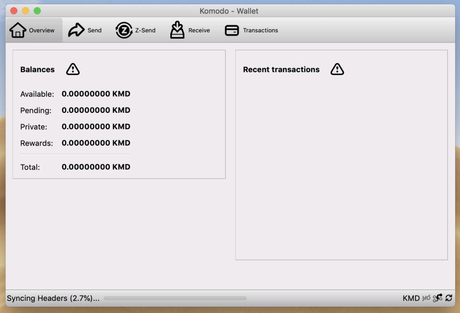

## KomodoOcean (komodo-qt) ##


Komodo-Qt (KomodoOcean) is a world-first Qt native wallet for KMD ([Komodo](https://komodoplatform.com/)) and all of assetchains. It's available for three OS platforms - Windows, Linux, MacOS.

**NB!** This repo have **three** branches:


- [master](../../tree/master) for Windows
- [Linux](../../tree/Linux) for Linux
- [MacOS](../../tree/MacOS) for MacOS

Visit [#wallet-ocean-qt](https://discord.gg/U5WWaJR) channel in Komodo Discord for more information.

### How to build? ###

The commands in this guide should be executed in a Terminal application. The built-in one is located in `/Applications/Utilities/Terminal.app`.

Install the macOS command line tools:

`xcode-select --install`

When the popup appears, click `Install`.

Then install [Homebrew](https://brew.sh/):

```
/usr/bin/ruby -e "$(curl -fsSL https://raw.githubusercontent.com/Homebrew/install/master/install)"
```

Paste that in a Terminal prompt.

If you already have installed brew before, update it: `brew update`

Install bitcoin-qt dependencies (some of them don't needed to build komodo-qt, but good to have it there):

```
brew install automake berkeley-db4 libtool boost miniupnpc openssl pkg-config protobuf python qt libevent qrencode
brew install librsvg
```

Install other needed dependencies:

```
brew install gcc@6
brew install coreutils # to have ginstall
```

Build:

```
git clone https://github.com/DeckerSU/KomodoOcean --branch MacOS --single-branch
cd KomodoOcean
./zcutil/fetch-params.sh
# -j8 = using 8 threads for the compilation - replace 8 with number of threads you want to use. don't use -j$(nproc) here, just place a number of threads after -j
./zcutil/build-mac.sh -j8 # this can take some time.

```

Create `komodo.conf` file in `~/Library/Application\ Support/Komodo/komodo.conf` :

```
md ~/Library/Application\ Support/Komodo
cat > ~/Library/Application\ Support/Komodo/komodo.conf <<EOL
rpcuser=yourrpcusername
rpcpassword=yoursecurerpcpassword
rpcbind=127.0.0.1
txindex=1
addnode=5.9.102.210
addnode=78.47.196.146
addnode=178.63.69.164
addnode=88.198.65.74
addnode=5.9.122.241
addnode=144.76.94.38
addnode=89.248.166.91
EOL
```

Launch:

```
./src/qt/komodo-qt &
```

Enjoy your `komodo-qt` wallet on your Mac :



### Notes for MacOS users ###

~~Unfortunatelly current version of Komodo-Qt wallet under MacOS don't have a Mac Dock Icon, so, launched app will looks like app launched from terminal. This behaviour possible will fix in future, for now it's not a primary task.~~

Mac Dock icon is fixed now.

Build instructions above was successfully tested on latest macOS Mojave 10.14.2 (18C54) installed from scratch.

### Developers of Qt wallet ###

- Main developer: [Ocean](https://github.com/ip-gpu)
- IT Expert / Sysengineer: [Decker](https://github.com/DeckerSU)