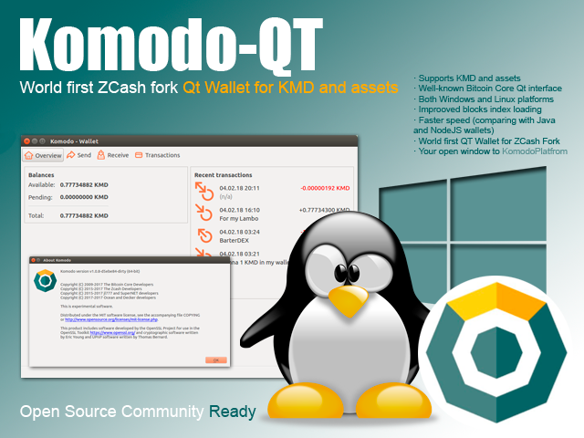
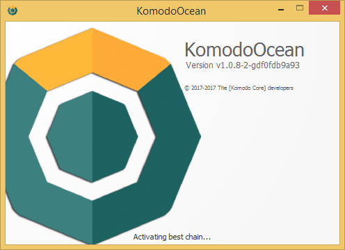
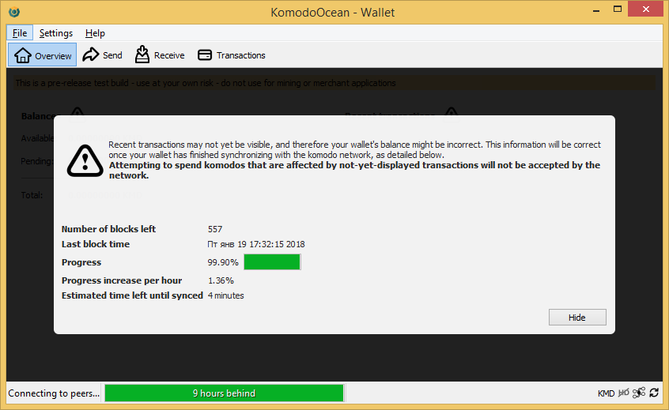
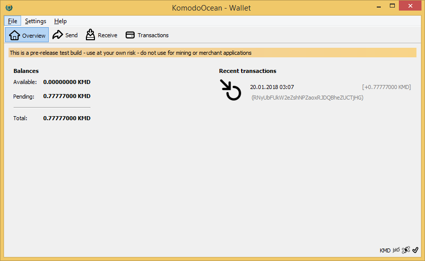
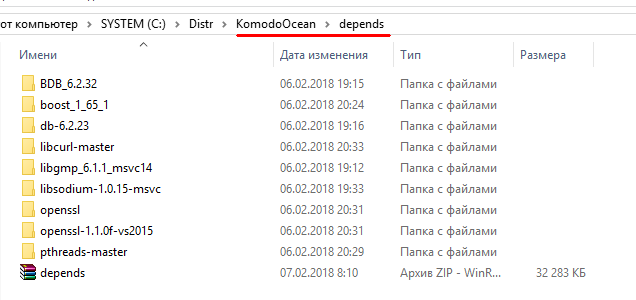
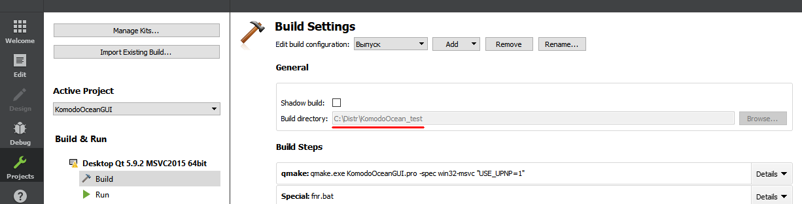

## KomodoOcean (komodo-qt) ##



This is *early alpha* of KomodoOcean / komodo-qt GUI qt-based wallet for Komodo (KMD). Probably (not sure) is a **world first Qt-Wallet** for ZCash based cryptocurrency forks. Now it available only for Windows (64-bit) and Linux (64-bit) platforms.

**NB!** This repo have two branches:

- *master* for Windows
- *Linux* for Linux



### System requirements ###

- Windows 8 / 8.1 / 10 (64-bit) based PC.
- At least 4 Gb of RAM (8 or 16 Gb RAM recommended).
- About 3.1 Gb of storage space to sync full blockchain (SSD drive is recommended)

Before you start create the following configuration file, named `komodo.conf` in %APPDATA%\Komodo folder:

    rpcuser=bitcoinrpc
    rpcpassword=password
    txindex=1
    addnode=5.9.102.210
    addnode=78.47.196.146
    addnode=178.63.69.164
    addnode=88.198.65.74
    addnode=5.9.122.241
    addnode=144.76.94.38
    addnode=89.248.166.91

And download [sprout-proving.key](https://z.cash/downloads/sprout-proving.key) and [sprout-verifying.key](https://z.cash/downloads/sprout-verifying.key) in %APPDATA%\ZcashParams folder. If you already have installed original komodod.exe (console daemon) for Windows, or Agama Wallet - you already have all needed. 

Alternative download links for ZcashParams:

- https://agama.komodoplatform.com/file/supernet/sprout-proving.key
- https://agama.komodoplatform.com/file/supernet/sprout-verifying.key

For more information about Komodo Platform, please visit official site: [https://komodoplatform.com/](https://komodoplatform.com/) . Also you can follow original jl777's komodo repo on GitHub - https://github.com/jl777/komodo .

### Project Status ###

Currenly komodo-qt is *under developement*. Use it at your own risk - do not use for mining or merchant applications, also we don't recommend now to use it with your main wallet. Before use you can copy your main wallet.dat in a secure place or use `-datadir` command-line key to select other data folder for use with komodo-qt.





Supported (tested) features:

- Launching GUI interface and syncing blockchain.
- Faster blockchain indexes loading in compare with original komodod for Windows. Estimated speed of loading fully synced blockchain indexes on KMD is **50 sec.** on Core i7-6700K / 64 Gb RAM / SSD drive, that approaches speed of Linux PC with same hardware.
- Receiving and sending coins.
- Extended coin control features, selecting "Inputs..." (UTXOs) when sending coins.
- Supporting assetchains (launch KomodoOceanGUI.exe with needed `-ac_name`, `-ac_supply` and `-addnode` command-line keys to launch wallet on needed assetchain).
- Correct quit from app (earlier versions of komodo-qt wasn't correct shutdown all of running threads).


Existing issues:

- You tell us ... ;)

### How to build? ###

System requirements:

- OS Windows 7 / 8 / 8.1 / 10 (**64-bit**)
- [Git for Windows](https://git-scm.com/download/win)
- Microsoft Visual Studio 2015 Version 14.0.25431.01 Update 3
- CMake 3.10.2 ([cmake-3.10.2-win64-x64.msi](https://cmake.org/files/v3.10/cmake-3.10.2-win64-x64.msi)), add it to system path for all users during install.
- Qt 5.9.2 ([qt-opensource-windows-x86-5.9.2.exe](https://download.qt.io/official_releases/qt/5.9/5.9.2/qt-opensource-windows-x86-5.9.2.exe))
- [Far Manager v3.0 build 5100 x64](https://www.farmanager.com/download.php?l=en) (not necessary, but very convenient to use command line and execute commands)

**1.** Download and install all needed software. Qt should be installed into it's default path `C:\Qt\Qt5.9.2` . 
**1a.** Don't forget to select `msvc2015 64-bit` component during install:


**2.** Clone sources repository using `git clone https://github.com/ip-gpu/KomodoOcean` or `git clone https://github.com/DeckerSU/KomodoOcean` .
**3.** Make sure that you are on Windows (master) branch `git checkout master` .
**4.** Unpack the content of `KomodoOcean\depends\depends.zip` archive in `KomodoOcean\depends` folder:



**5.** Launch Qt Creator and choose Open Project. Navigate to `KomodoOcean` directory and open `KomodoOceanGUI.pro` project file.
**5a.** Make sure that Build directory in Projects -> Build Settings corresponds to your project path (for example `C:\Distr\KomodoOcean`, this is a folder in which we clone repo).



**6.** Select Build -> Build Project "KomodoOceanGUI" from Top Menu or press Ctrl-B to start build.

**7.** After build is finished you will see ```KomodoOceanGUI.exe``` in ```release``` folder.

Congratulations! You built Komodo-Qt (KomodoOcean) for Windows. Now you can run it. 

### Developers of Qt wallet ###

- Main developer: [@Ocean](https://komodo-platform.slack.com/team/U8BRG09EV)
- IT Expert / Sysengineer: [@Decker](https://komodo-platform.slack.com/messages/D5UHJMCJ3)