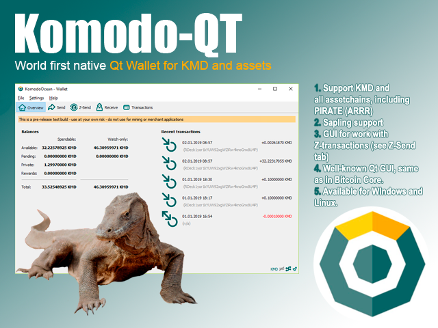

## KomodoOcean (komodo-qt) ##



Komodo-Qt (KomodoOcean) is a world-first Qt native wallet for KMD ([Komodo](https://komodoplatform.com/)) and all of assetchains. It's available for three OS platforms - Windows, Linux, MacOS.

**NB!** This repo have **three** branches:


- [master](../../tree/master) for Windows
- [Linux](../../tree/Linux) for Linux
- [MacOS](../../tree/MacOS) for MacOS

Visit [#wallet-ocean-qt](https://discord.gg/U5WWaJR) channel in Komodo Discord for more information.

### How to build? ###

Following dependencies are needed:

```
sudo apt-get install build-essential pkg-config libcurl3-gnutls-dev libc6-dev libevent-dev m4 g++-multilib autoconf libtool ncurses-dev unzip git python zlib1g-dev wget bsdmainutils automake libboost-all-dev libssl-dev libprotobuf-dev protobuf-compiler libqt4-dev libqrencode-dev libdb++-dev ntp ntpdate

sudo apt-get install libcurl4-gnutls-dev 
```

To build Qt wallet execute first:

```
sudo apt-get install libqt5gui5 libqt5core5a libqt5dbus5 qttools5-dev qttools5-dev-tools libprotobuf-dev protobuf-compiler
```

Aslo, if you issued troubles with dependencies, may be this [doc](https://github.com/bitcoin/bitcoin/blob/master/doc/build-unix.md) will be useful.

To build (Ubuntu 16.x / 18.x):

```
cd ~
git clone https://github.com/DeckerSU/KomodoOcean.git
cd KomodoOcean
git checkout Linux
zcutil/build.sh -j$(nproc)
cd src/qt
./komodo-qt & # launch
```

- If during build you get error like "fatal error: sodium.h: No such file or directory compilation terminated.", try to install libsodium-dev:

```
sudo apt install libsodium-dev
```
- "fatal error: gmp.h: No such file or directory compilation terminated.", try to install libgmp-dev:

```
sudo apt install libgmp-dev
```


### Additional info ###

- `-rootcertificates=` arg for launching under Ubuntu 16.04 don't needed anymore. Since we have payment request support (bip70) disabled by default. 

### Qt Versions Notes ###

By default Ubuntu 16.04 uses old version of Qt 5.5.1 (it's installed from by default from Xenial repos), if you want to change this behaviour and build against Qt 5.9.1 you'll need to do the following:

```
wget http://download.qt.io/official_releases/qt/5.9/5.9.1/qt-opensource-linux-x64-5.9.1.run
chmod +x qt-opensource-linux-x64-5.9.1.run
./qt-opensource-linux-x64-5.9.1.run # during installation leave install folder "AS IS", i.e. $HOME/Qt5.9.1
qtchooser -install -local qt5.9.1 $HOME/Qt5.9.1/5.9.1/gcc_64/bin/qmake 
# this will create $HOME/.config/qtchooser/qt5.9.1.conf 
...
git clone https://github.com/DeckerSU/KomodoOcean
cd KomodoOcean
git checkout Linux
git pull
QT_LDFLAGS="-Wl,-rpath=$HOME/Qt5.9.1/5.9.1/gcc_64/lib" PKG_CONFIG_PATH="$(pwd)/depends/x86_64-unknown-linux-gnu/lib/pkgconfig:$HOME/Qt5.9.1/5.9.1/gcc_64/lib/pkgconfig" zcutil/build.sh -j$(nproc) # override configure check for Qt package and build
./src/qt/komodo-qt -rootcertificates= & # for launch
```

### Developers of Qt wallet ###

- Main developer: [@Ocean](https://komodo-platform.slack.com/team/U8BRG09EV)
- IT Expert / Sysengineer: [@Decker](https://komodo-platform.slack.com/messages/D5UHJMCJ3)