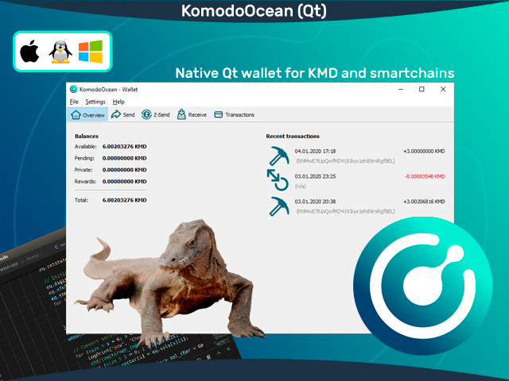

# KomodoOcean (komodo-qt) #




Komodo-Qt (KomodoOcean) is a world-first Qt native wallet for KMD ([Komodo](https://komodoplatform.com/)) and smartchains (assetchains). It's available for three OS platforms - Windows, Linux, MacOS.

Use the default `static` branch and following scripts to build:

- Linux: `build.sh` (native build)
- Windows: `build-win.sh` (cross-compilation for Win)
- MacOS: `build-mac-cross.sh` (cross-compilation for OSX)
- MacOS: `build-mac.sh` (native build)

Visit `#🤝│general-support` or `#wallet-ocean-qt` channel in [Komodo Discord](https://komodoplatform.com/discord) for more information.

## How to build? ##

#### Linux

```shell
#The following packages are needed:
sudo apt-get install build-essential pkg-config libc6-dev m4 g++-multilib autoconf libtool ncurses-dev unzip git python bison zlib1g-dev wget libcurl4-gnutls-dev bsdmainutils automake curl
```

```shell
git clone https://github.com/DeckerSU/KomodoOcean --branch static --single-branch
cd komodo
./zcutil/fetch-params.sh
# -j8 = using 8 threads for the compilation - replace 8 with number of threads you want to use
./zcutil/build-linux.sh -j8
#This can take some time.
```

#### OSX (Cross-compile)

Before start, read the following docs: [depends](https://github.com/bitcoin/bitcoin/blob/master/depends/README.md), [macdeploy](https://github.com/bitcoin/bitcoin/blob/master/contrib/macdeploy/README.md) .

Install dependencies:
```
sudo apt-get install curl librsvg2-bin libtiff-tools bsdmainutils cmake imagemagick libcap-dev libz-dev libbz2-dev python3-setuptools libtinfo5 xorriso
```

Place prepared SDK file `Xcode-12.1-12A7403-extracted-SDK-with-libcxx-headers.tar.gz` in repo root, use `build-mac-cross.sh` script to build.

#### OSX (Native)
Ensure you have [brew](https://brew.sh) and Command Line Tools installed.
```shell
# Install brew
/usr/bin/ruby -e "$(curl -fsSL https://raw.githubusercontent.com/Homebrew/install/master/install)"
# Install Xcode, opens a pop-up window to install CLT without installing the entire Xcode package
xcode-select --install 
# Update brew and install dependencies
brew update
brew upgrade
brew tap discoteq/discoteq; brew install flock
brew install autoconf autogen automake
# brew install gcc@6
brew install binutils
brew install protobuf
brew install coreutils
brew install wget
# Clone the Komodo repo
git clone https://github.com/DeckerSU/KomodoOcean --branch static --single-branch
# Change master branch to other branch you wish to compile
cd komodo
./zcutil/fetch-params.sh
# -j8 = using 8 threads for the compilation - replace 8 with number of threads you want to use
./zcutil/build-mac.sh -j8
# This can take some time.
```

#### Windows
Use a debian cross-compilation setup with mingw for windows and run:
```shell
sudo apt-get install build-essential pkg-config libc6-dev m4 g++-multilib autoconf libtool ncurses-dev unzip git python python-zmq zlib1g-dev wget libcurl4-gnutls-dev bsdmainutils automake curl cmake mingw-w64
curl https://sh.rustup.rs -sSf | sh
source $HOME/.cargo/env
rustup target add x86_64-pc-windows-gnu

sudo update-alternatives --config x86_64-w64-mingw32-gcc
# (configure to use POSIX variant)
sudo update-alternatives --config x86_64-w64-mingw32-g++
# (configure to use POSIX variant)

git clone https://github.com/DeckerSU/KomodoOcean --branch static --single-branch
cd komodo
./zcutil/fetch-params.sh
# -j8 = using 8 threads for the compilation - replace 8 with number of threads you want to use
./zcutil/build-win.sh -j8
#This can take some time.
```
**komodo is experimental and a work-in-progress.** Use at your own risk.

*p.s.* Currently only `x86_64` arch supported for MacOS, build for `Apple M1` processors unfortunately not yet supported.

## Create komodo.conf ##

Before start the wallet you should [create config file](https://github.com/DeckerSU/KomodoOcean/wiki/F.A.Q.#q-after-i-start-komodo-qt-i-receive-the-following-error-error-cannot-parse-configuration-file-missing-komodoconf-only-use-keyvalue-syntax-what-should-i-do) `komodo.conf` at one of the following locations:

- Linux - `~/.komodo/komodo.conf`
- Windows - `%APPDATA%\Komodo\komodo.conf`
- MacOS - `~/Library/Application Support/Komodo/komodo.conf`

With the following content:

```
txindex=1
rpcuser=komodo
rpcpassword=local321 # don't forget to change password
rpcallowip=127.0.0.1
rpcbind=127.0.0.1
server=1
```

Bash one-liner for Linux to create `komodo.conf` with random RPC password:

```
RANDPASS=$(tr -cd '[:alnum:]' < /dev/urandom | fold -w16 | head -n1) && \
tee -a ~/.komodo/komodo.conf << END
txindex=1
rpcuser=komodo
rpcpassword=${RANDPASS}
rpcallowip=127.0.0.1
rpcbind=127.0.0.1
server=1
END
```

## Developers of Qt wallet ##

- Main developer: **Ocean**
- IT Expert / Sysengineer: **Decker**
